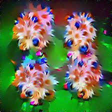
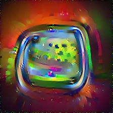
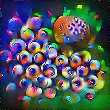
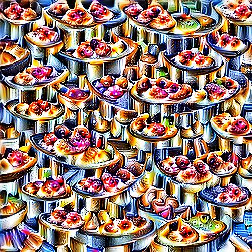
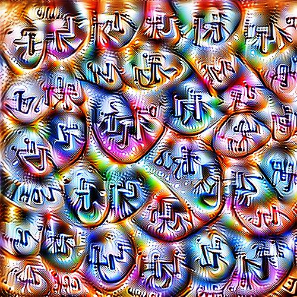
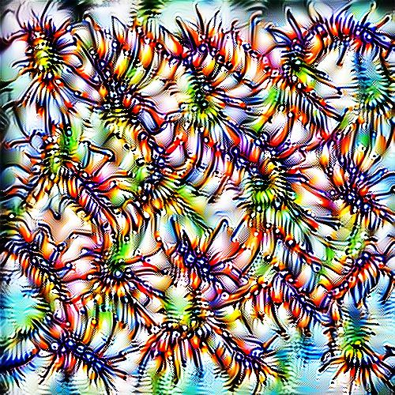
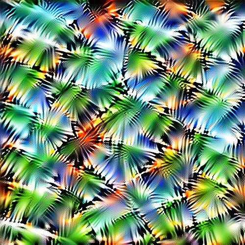
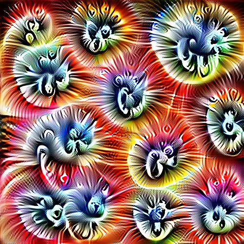
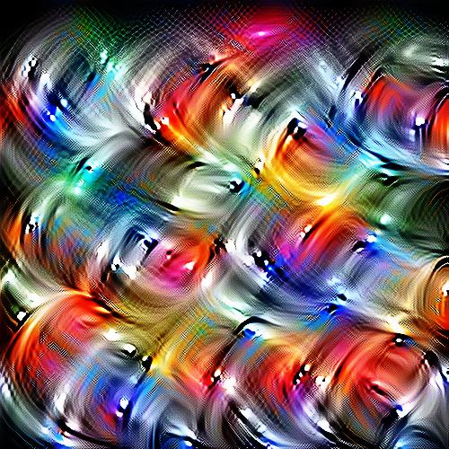
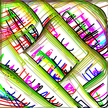

## :wrench: INSTALLATION :wrench:

#### Classical neuron excitation
First install docker with nvidia support : [link](https://github.com/NVIDIA/nvidia-docker)

Go to the directory 
`cd neural-styles`

Start a docker with a pytorch image :

`sudo docker run --rm -it --init   --runtime=nvidia   --ipc=host   --user="$(id -u):$(id -g)"   --volume=$PWD:/app   -e NVIDIA_VISIBLE_DEVICES=0   anibali/pytorch /bin/bash`

Install the requirements
`pip install -r requirements.txt`

You can now run the script
`python3 neuron_excitation.py`

In another tab, you can run
`sudo docker run -d -p 6006:6006 -v $(pwd)/logs:/logs --name my-tf-tensorboard volnet/tensorflow-tensorboard`
It will allow you to visualize the loss of the current training in a tensorboard tab. Open `http://localhost:6006/#scalars` to get the visualization


#### SVG neuron excitation
Executed on Linux 21.04
```
python3 -m venv venv
source venv
bash install_pydiffvg.sh
```


## :gem: Some results :gem:

#### Classical neuron excitation :accept:
Some result on channel excitation `L[:, c, :, :]`: 

On AlexNet, last convolution layer : 





On VGG16, Conv 5_1 : 





On ResNet18, fourth residual block : 






#### SVG neuron excitation :pencil2:

B&W neuron optimization with lines only :penguin:


Color neuron optimization with lines only :rainbow:




