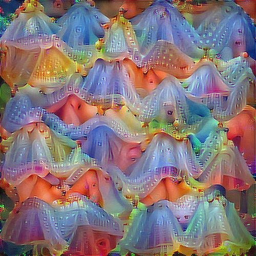
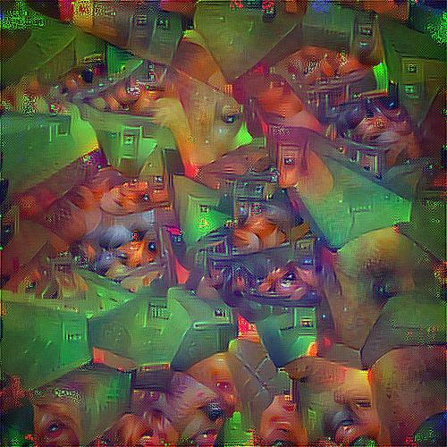
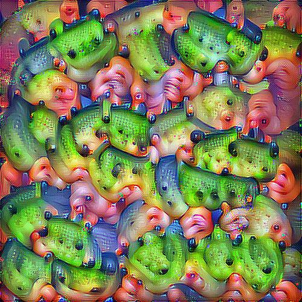
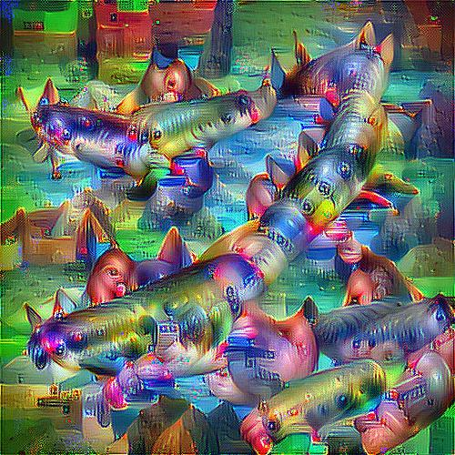

## :wrench: INSTALLATION :wrench:
First install docker with nvidia support : [link](https://github.com/NVIDIA/nvidia-docker)

Go to the directory 
`cd neural-styles`

Start a docker with a pytorch image :

`sudo docker run --rm -it --init   --runtime=nvidia   --ipc=host   --user="$(id -u):$(id -g)"   --volume=$PWD:/app   -e NVIDIA_VISIBLE_DEVICES=0   anibali/pytorch /bin/bash`

Install the requirements
`pip install -r requirements.txt`

You can now run the script
`python3 neuron_excitation.py`

In another tab, you can run
`sudo docker run -d -p 6006:6006 -v $(pwd)/logs:/logs --name my-tf-tensorboard volnet/tensorflow-tensorboard`
It will allow you to visualize the loss of the current training in a tensorboard tab. Open `http://localhost:6006/#scalars` to get the visualization

## :gem: Some results :gem:
Some result on channel excitation `L[:, c, :, :]`: 

<<<<<<< HEAD
On AlexNet : 

On VGG16 : 

On VGG19 : 

=======
On AlexNet, last convolution layer : 

On VGG16, Conv 5_1 : 

On ResNet18, fourth residual block : 

>>>>>>> 9f4ef65025b3212ddd6fc5ec82350a227ebd63ee

