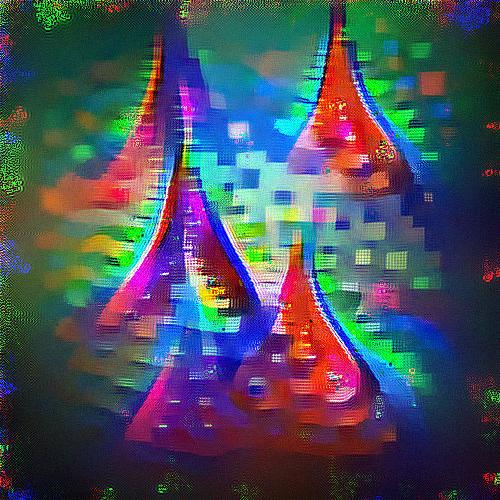
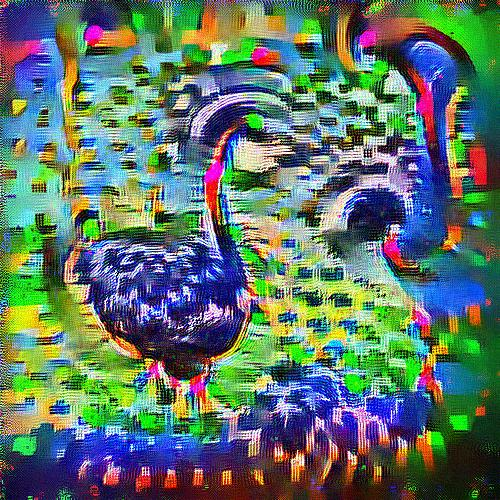
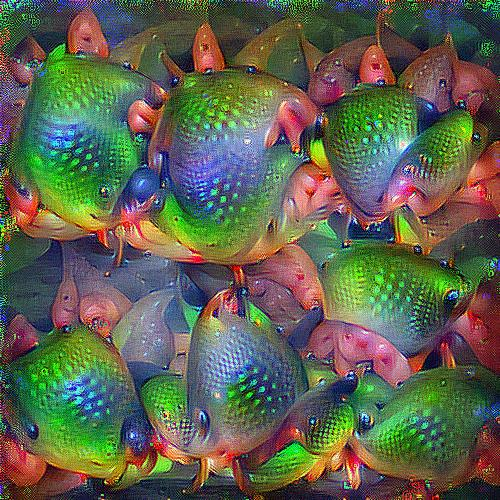

# Neuron excitation

We build a program to create image that maximize a neural netwrok intermediate representation. In other words, we find an image that excitate as much as possible a particular state.

### How does it work ? 

We initially train a neural network function to recognize concepts (usually ImageNet with 1000 object classes). 
A neural network has a set of intermediate feature before the classification one that defines what kind of classe ther input image belongs to. We use one of these intermediate representation as a surogate objective for our parametrizable image.

`Objective(I) = -mean(Network_layer_score(I)) + regularization(I)`

The neural network is differentiable and thus we can get a gradient to improve our image and get a lower objective.

### What does it look like ?

It looks different from network to network and layer to layer.
Let's see some examples

Same architecture, different layers

Last layer, different architecture

### Difficulties

The network "vision" is not perfect and is very sensitive to noise. We need to limit the presence of high frequency noise, but on the other hand this noise limitation may cause the input image to stay black.
Several tricks must be used to make the task of the optimizer a little bit easier, the network itself should also be modified to be easier to back-propagate.
